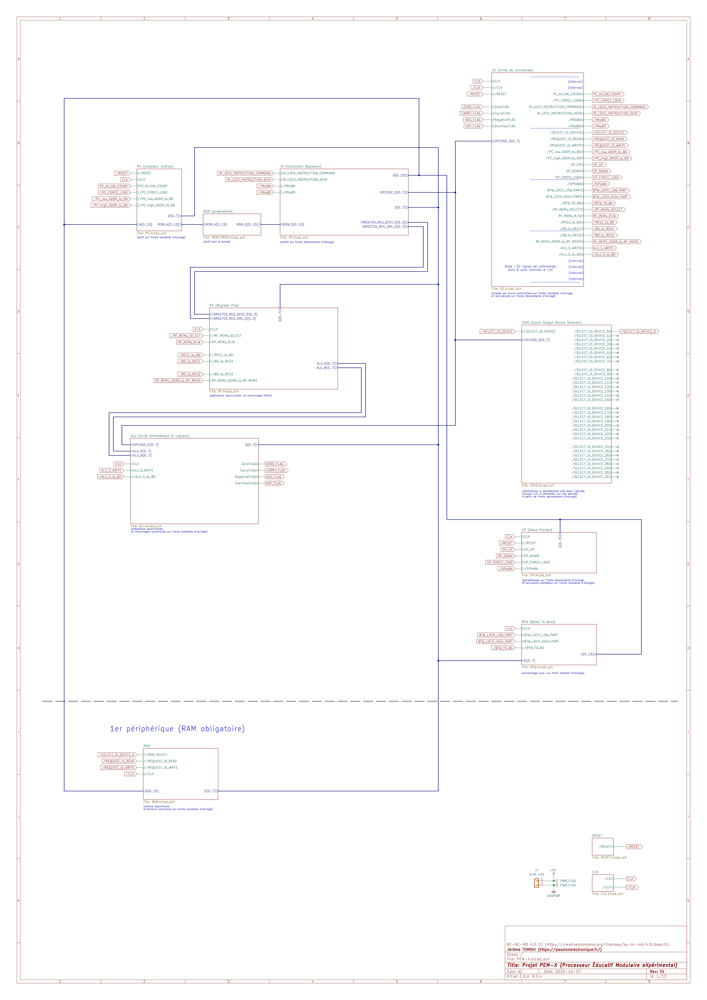

# Projet PEM-X : Processeur Éducatif Modulaire eXpérimental

## 🔎 Sommaire

- [Introduction](#-introduction)
- [Architecture en bref](#%EF%B8%8F-architecture-en-bref)
- [Cartes modulaires (avancement projet)](#%EF%B8%8F-cartes-modulaires-avancement-projet)
- [Schéma électronique global](#-schéma-électronique-global)
- [Pourquoi un tel projet](#-pourquoi-un-tel-projet-)
- [Licence](#-licence)
- [Contact](#-contact)

> Projet en cours de développement !!

## 📦 Introduction

Le projet "PEM-X" est un :

- **microprocesseur 8 bits**
- avec **uniquement des puces 74HCxx + RAM + ROM**
- qui se veut **100% open-source**, **éducatif**, et **modulaire**

Conçu pour **apprendre l'électronique**, étape par étape.

## ⚙️ Architecture en bref

- **Type** : Processeur 8 bits, architecture Harvard modifiée
- **Bus** :
  - ROM programme : 16 bits (adresse) et 16 bits (données)
  - PÉRIPHÉRIQUES I/O : 16 bits (adresse) et 8 bits (données)
- **Mémoires** :
  - 64K×16 bits de ROM (programme)
  - 64K×8 bits de RAM (pile comprise)
- **Instructions** : CISC compact
  - 26 instructions de base :
    - Système : NOP, HALT, SLEEP
    - Données : LD, MOV, PUSH, POP
    - ALU : ADD, ADC, SUB, SBC, NEG, CP, AND, OR, XOR, NOT, SHR, SHL
    - Contrôle : JMP, CALL, RET + instructions conditionnelles sur flags
  - 64 instructions I/O :
    - Lecture : IN0, IN1,..., IN31
    - Écriture : OUT0, OUT1,..., OUT31
- **Registres** : 16 registres de 8 bits
- **Drapeaux** : Zéro, Carry, Négatif, Overflow
- **Microcode** : 32 bits, avec 1 à 16 µ-instruction par instruction
- **Périphériques** : jusqu'à 32
  - Périphérique 0 => RAM obligatoire
  - Périphériques 1 à 31 => libres (timer, UART, LCD, …)
- **Cartes** :
  - 1 carte support
  - 1 carte par fonction interne, ou presque (une carte ALU, une carte RAM, etc)

## 🛠️ Cartes modulaires (avancement projet)

| Nom                             | Description                                                                                                                                                                         | État       |
| ------------------------------- | ----------------------------------------------------------------------------------------------------------------------------------------------------------------------------------- | ---------- |
| **Préparation projet**          | Schéma global, avec recherches préalables                                                                                                                                           | Fait ✅    |
| **Carte support + CLK + RESET** | Alimentation +5V, distribution des bus d’adresse/données/commande partagés, horloge 4 MHz (CLK), et RESET                                                                           | À faire ⏳ |
| **Carte PC + ROM + IR**         | Compteur de programme (CP), ROM programme (ROM), registres d’instruction (IR)                                                                                                       | À faire ⏳ |
| **Carte UC**                    | Unité de commande (UC), avec Micro-ROM et logique de séquençage intégrés                                                                                                            | À faire ⏳ |
| **Carte RF**                    | Register Files (RF), avec 16 registres de 8 bits intégrés                                                                                                                           | À faire ⏳ |
| **Carte ALU**                   | Unité arithmétique et logique (ALU), avec sortie drapeaux Z, C, N, V (flags zero/carry/neg/ovf)                                                                                     | À faire ⏳ |
| **Carte IODS + SP + BTW**       | I/O Device Selector (DS), Stack pointer (SP), et ByteToWord (BTW)                                                                                                                   | À faire ⏳ |
| **Carte RAM**                   | 8 Ko de RAM (partagée par programme et pile) ; pour rappel, ce sera le périphérique #0, obligatoire pour un bon fonctionnement du processeur (avec utilisation de la pile et autre) | À faire ⏳ |
| **Carte Périphérique #1**       | Une interface homme-machine, avec des interrupteurs (microswitchs) et/ou boutons-poussoirs, ainsi que des voyants et/ou afficheurs 7 segments                                       | À faire ⏳ |

> Chaque carte aura son **article dédié** sur [Passion Électronique](https://passionelectronique.fr) avec schémas, photos, et tests réalisés dessus.

> Sujet à modifications, au fur et à mesure de l'avancement du projet.

## 🚧 Schéma électronique global

Schéma électronique global du projet PEM-X (sujet à modifications) :

## 🎨 Pourquoi un tel projet ?

- **Parce que c'est un rêve que j'ai depuis que je suis gosse !** Alors il était temps de le réaliser (j'ai aujourd'hui 46 ans)
- **Parce que j'aime partager**, surtout sur des sujets que j'aurais aimé trouver sur le net, et que j'aurais surtout aimé trouver écrits en français (même si j'ai utilisé pas mal de sigles anglais, pour être plus concis par endroits)
- **Pour exercer ma créativité, sans bêtement copier les autres**, et ainsi imaginer des solutions inventives et originales, en prenant un maximum de plaisir (comme le système à double RAM dans le Register File, pour économiser tout un tas de puces 74HCxx)

## 📖 Licence

Licence BY-NC-ND 4.0 CC 
Lien : https://creativecommons.org/licenses/by-nc-nd/4.0/deed.fr

## 📬 Contact

- **Site web** : [passionelectronique.fr](https://passionelectronique.fr)
- **GitHub** : [PassionElectronique](https://github.com/PassionElectronique)
- **X/Twitter** : [Jérôme TOMSKI](https://x.com/jerometomski)

---

@2025 
Créé par Jérôme TOMSKI
